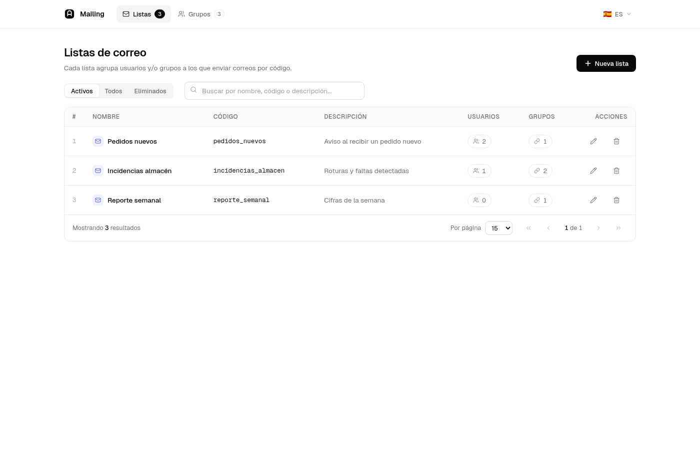
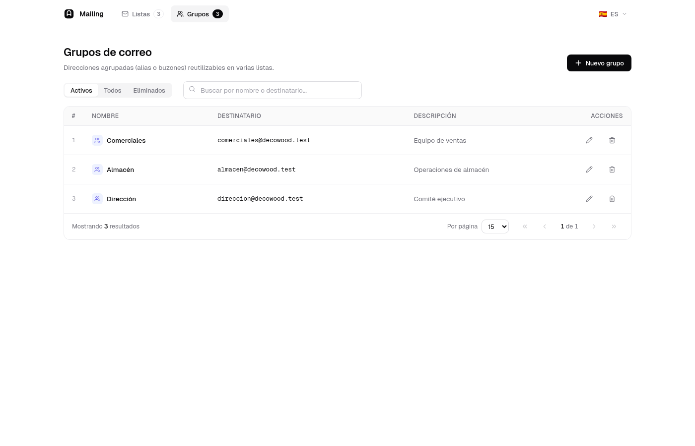
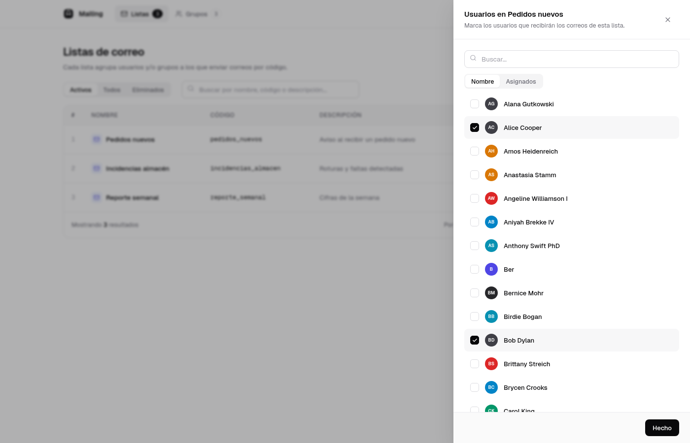

# Laravel Mailing

Manage mailing lists in Laravel: each list is a named collection of internal users + arbitrary external email addresses (grouped into "mailing groups"). Ships with a React admin UI and a helper to resolve a list's full recipient set from code.

Typical flow: create a list, add local users to it, optionally add an external mailing group, and from your code call `MailingList::get('list_code')` to get the final list of email addresses to send to.

## Requirements

- PHP `^8.3`
- Laravel `^13.0`
- A `users` table in your host app. The `MailingList` model attaches users via `belongsToMany` to a configurable User class (defaults to `App\Models\User`, see [Configuration](#configuration)).

## Installation

```bash
composer require sefirosweb/laravel-mailing:^13.0
```

The service provider auto-registers via Laravel's package discovery.

Run migrations:

```bash
php artisan migrate
```

Creates four tables: `mailing_lists`, `mailing_groups`, `mailing_list_user` (pivot for users), and `mailing_group_mailing_list` (pivot for groups inside a list).

## Configuration

Publish the config:

```bash
php artisan vendor:publish --provider="Sefirosweb\LaravelMailing\LaravelMailingServiceProvider" --tag=config --force
```

Default `config/laravel-mailing.php`:

```php
return [
    'prefix'     => 'mailgroups',
    'middleware' => 'web',
    'stage_to'   => env('MAIL_LIST_STAGE_TO', 'Create "MAIL_LIST_STAGE_TO" in .env with default mail'),
    'User'       => \App\Models\User::class,
];
```

- `prefix`: URL prefix for the bundled admin UI (`/mailgroups/...`).
- `middleware`: middleware stack for those routes.
- `stage_to`: a single email address used in non-production environments — see [Environment-aware recipients](#environment-aware-recipients) below.
- `User`: the Eloquent model used as the user side of the `mailing_list_user` pivot. Override to point the package at your custom User model without forking it.

> ⚠️ **Security**: the admin UI manages mailing recipients. Always protect it with auth + an ACL check. If you use [`sefirosweb/laravel-access-list`](https://github.com/sefirosweb/laravel-access-list):
>
> ```php
> 'middleware' => ['web', 'auth', 'checkAcl:mailing_edit'],
> ```

Publish the React admin UI assets:

```bash
php artisan vendor:publish --provider="Sefirosweb\LaravelMailing\LaravelMailingServiceProvider" --tag=mailing-assets --force
```

## Usage

### 1. Create lists and groups from the UI

Browse to `/mailgroups` (or the configured prefix). The bundled UI is a self-contained React 19 + Vite SPA with two top-level tabs:

- **Listas** — table of mailing lists with name / code / description and a counter for users + groups attached. Each row opens two relations drawers (Users, Groups) for live attach/detach with optimistic updates. Soft-delete UI with an Activos / Todos / Eliminados segmented filter and a Restore action.
- **Grupos** — table of mailing groups (reusable external recipients with `name` + `to`). Same soft-delete UX.

Both tables ship with debounced search (200 ms), client-side pagination and per-row spinners on in-flight toggles. Hash routing keeps tabs deep-linkable (`/mailgroups/#lists`, `/mailgroups/#groups`). i18n with browser language detection (ES / EN) plus a manual switcher in the top nav.





Definitions:

- **Mailing list**: a named collection addressed by a **code** (machine identifier used from code). Attach internal users by searching their name.
- **Mailing group**: a reusable external recipient with `name` + `to` (email). Add groups to a list when you need to email someone who is not a user in your system.

### 2. Resolve recipients from code

Given a list with `code = 'weekly_report'`:

```php
use Sefirosweb\LaravelMailing\Http\Helpers\MailingList;

$recipients = MailingList::get('weekly_report');
// ['alice@acme.test', 'bob@acme.test', 'external@vendor.test']

Mail::to($recipients)->send(new WeeklyReportMail($data));
```

Returns `[]` if no list with that code exists.

### 3. Environment-aware recipients

`MailingList::get()` checks `config('app.env')`. **Only in `production`** does it resolve the real recipients. In any other environment it returns `[config('laravel-mailing.stage_to')]` so test/staging runs never email real users by accident.

Set the staging recipient:

```dotenv
MAIL_LIST_STAGE_TO=dev@acme.test
```

## Testing

```bash
composer install
./vendor/bin/phpunit
```

The Orchestra Testbench suite covers controller CRUD, list↔user and list↔group pivot management, and validation edge cases.

> Note: `MailingGroupRequest` validates `to` with the `email:dns` rule, which performs a live DNS lookup. The test suite uses `gmail.com` so tests don't depend on custom domain resolution.

When working from the [laravel-test](https://github.com/sefirosweb/laravel-test) harness with Sail:

```bash
docker exec -w /var/www/html/packages/laravel-mailing laravel-test-laravel.test-1 ./vendor/bin/phpunit
```

## Versioning

Major versions are aligned with Laravel majors (`12.x`, `11.x`, `9.x` …). See the root [CLAUDE.md](https://github.com/sefirosweb/laravel-test/blob/12.0/CLAUDE.md) of the test harness for the full policy.

## License

MIT.
